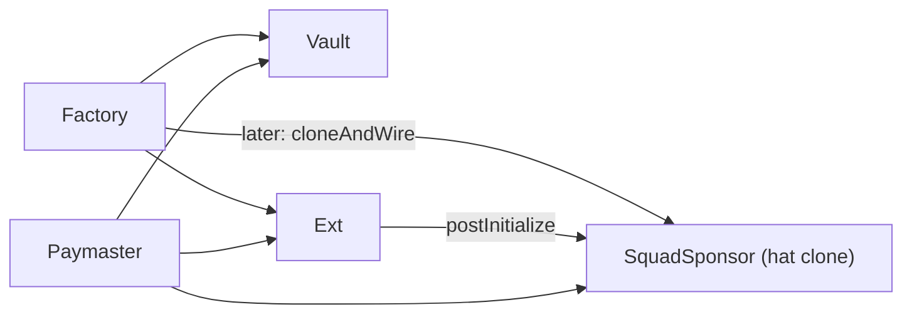
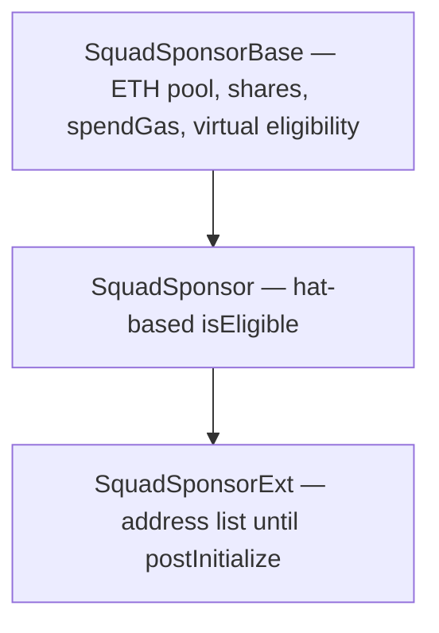

# Squad Sponsor Refactor Plan

**Status:** Phase 4–5 complete. Refactor done; unit tests green.  
**Reference pattern:** `SquadAdminBase` → `SquadAdmin` → `SquadAdminExt` in [pacto-gov](../pacto-gov)

---

## Problem with the current design

Today the lifecycle deploys **three contracts per squad**:



That splits pool custody, eligibility, and “extension” into separate addresses. The Ext is a sibling module, not an extension of the sponsor.

---

## Target architecture

Follow the pacto-gov SquadAdmin inheritance chain:



**Deployment rule:** a squad deploys **exactly one** clone:

| Squad situation | Deploy | Gets |
|-----------------|--------|------|
| Has Hats tree / PactoGov ready | `SquadSponsor` | Pool + hat eligibility |
| No governance yet | `SquadSponsorExt` | Pool + address eligibility |
| Ext squad later gets Hats | Same Ext clone | `postInitialize` wires hats **on the same contract** |

No vault. No separate hat clone at wiring time.

---

## Phase 1 — Interface layer

### 1.1 Add `ISquadSponsorBase`

Move all **non-eligibility-specific** surface here (what the vault used to own):

- Events: `Deposited`, `Withdrawn`, `GasSpent`
- Errors: paymaster-only, zero amount, no shares, insufficient balance, transfer failed
- Core API:
  - `initialize(bytes32 squadId, address paymaster, address factory)` (minimal bootstrap)
  - `deposit()`, `depositFor(address)`, `withdraw()`, `spendGas(uint256)`
  - Views: `squadId()`, `paymaster()`, `factory()`, `totalShares()`, `sponsorShares()`, `withdrawable()`
- Eligibility hook: `isEligible(address member) external view returns (bool)`

Replaces `ISquadSponsorVault` entirely.

### 1.2 Refactor `ISquadSponsor`

Make it **`ISquadSponsor is ISquadSponsorBase`**, like `ISquadAdmin is ISquadAdminBase`.

Add hat-specific surface:

- `initialize(bytes32 squadId, address paymaster, address factory, uint256 topHatId, address registry, uint256[] customEligibleHats)`
- `postInitialize(uint256 topHatId, address registry, uint256[] customEligibleHats)` for hat wiring on an Ext that started address-only
- Views: `topHatId()`, `registry()`, `customEligibleHats()`, `customEligibleHatsLength()`

Remove inheritance from `ISquadSponsorEligibility` — eligibility lives on the base interface.

### 1.3 Refactor `ISquadSponsorExt`

Make it **`ISquadSponsorExt is ISquadSponsor`**, like `ISquadAdminExt is ISquadAdmin`.

Keep Ext-only surface:

- `initialize(bytes32 squadId, address paymaster, address factory, address addressOwner)` — address-bootstrap path
- `setPermittedAddress`, `transferAddressOwner`
- Views: `addressOwner()`, `permittedAddress()`, `hatsWired()`

**Remove from Ext interface:**

- `vault()` — the contract **is** the vault
- `squadSponsorBase()` — no separate base clone
- Old `postInitialize(uint256 topHatId, address squadSponsorBase)` — replaced by hat params on the same contract

### 1.4 Delete obsolete interfaces

| Remove | Reason |
|--------|--------|
| `ISquadSponsorVault.sol` | Funds live in `SquadSponsorBase` |
| `ISquadSponsorEligibility.sol` | Folded into `ISquadSponsorBase.isEligible` |

### 1.5 Refactor `ISquadSponsorFactory`

**Before:** `SquadRecord { vault, ext, base, topHatId }`  
**After:** `SquadRecord { sponsor, variant, topHatId }` where `variant` is `SPONSOR` | `EXT`

Factory API:

```solidity
function createSquadSponsor(bytes32 squadId, uint256 topHatId, address registry, uint256[] calldata customEligibleHats)
  external payable returns (address sponsor);
function createSquadSponsorExt(bytes32 squadId) external payable returns (address sponsor);
// remove cloneAndWireSquadSponsor entirely
```

Registry: `squadIdBySponsor(address)` replaces `squadIdByVault` + `squadIdByExt`.  
Implementations: `sponsorImplementation`, `extImplementation` — drop `vaultImplementation`.

---

## Phase 2 — Contract layer

### 2.1 Create `abstract SquadSponsorBase`

Location: `src/contracts/abstracts/SquadSponsorBase.sol`

Move from `SquadSponsorVault`: storage, deposit/withdraw/spendGas, pro-rata math, `receive`/`fallback`.

Add virtual `_isEligible(address)` hook; public `isEligible` delegates to it.

### 2.2 Refactor `SquadSponsor`

Inherits `SquadSponsorBase`; hat-based `_isEligible`; one clone = pool + eligibility.

### 2.3 Refactor `SquadSponsorExt`

Inherits `SquadSponsor`; address eligibility until `postInitialize`; then `super._isEligible` on the same contract.

### 2.4 Delete `SquadSponsorVault.sol`

### 2.5 Refactor `SquadSponsorFactory`

Two master copies; one clone per squad; remove `cloneAndWireSquadSponsor`.

### 2.6 Refactor `PactoSponsorPaymaster` + `IPactoSponsorPaymaster`

Simplify `paymasterAndData` to `(version, squadId, sponsor, member)`.

---

## Phase 3 — Storage layout and inheritance order

**Inheritance (concrete chain):**

```
SquadSponsorExt is ISquadSponsorExt, SquadSponsor is ISquadSponsor, SquadSponsorBase
```

**Verified layout** (`forge inspect SquadSponsorExt storage-layout`):

| Slot | Variable | Contract |
|------|----------|----------|
| 0 | `squadId` | `SquadSponsorBase` |
| 1 | `paymaster` | `SquadSponsorBase` |
| 2 | `factory` | `SquadSponsorBase` |
| 3 | `totalShares` | `SquadSponsorBase` |
| 4 | `sponsorShares` | `SquadSponsorBase` |
| 5 | `topHatId` | `SquadSponsor` |
| 6 | `registry` | `SquadSponsor` |
| 7 | `_customEligibleHats` | `SquadSponsor` |
| 8 | `addressOwner` + `hatsWired` (packed) | `SquadSponsorExt` |
| 9 | `permittedAddress` | `SquadSponsorExt` |

`Initializable` (OZ v5) uses ERC-7201 namespaced storage and does not occupy linear slots 0–9.

**Rules:** append-only per layer; never reorder or insert variables between layers. New state goes at the end of the most-derived contract that needs it.

---

## Phase 4 — Target file tree ✅

```
src/
├── abstracts/
│   └── SquadSponsorBase.sol
├── contracts/
│   ├── SquadSponsor.sol
│   ├── SquadSponsorExt.sol
│   ├── SquadSponsorFactory.sol
│   └── PactoSponsorPaymaster.sol
└── interfaces/
    ├── ISquadSponsorBase.sol
    ├── ISquadSponsor.sol
    ├── ISquadSponsorExt.sol
    ├── ISquadSponsorFactory.sol
    └── IPactoSponsorPaymaster.sol

test/unit/
├── SquadSponsorPool.t.sol      # was SquadSponsorVault.t.sol
├── SquadSponsorFactory.t.sol
├── SquadSponsorExt.t.sol
├── SquadSponsor.t.sol
├── PactoSponsorPaymaster.t.sol
└── UnitSquadSponsorBase.sol
```

**Deleted:** `SquadSponsorVault.sol`, `ISquadSponsorVault.sol`, `ISquadSponsorEligibility.sol`, `SquadSponsorVault.t.sol`

---

## Phase 5 — Implementation order ✅

| Step | Work | Status |
|------|------|--------|
| 1 | `ISquadSponsorBase` + `SquadSponsorBase` with vault logic | ✅ |
| 2 | Refactor `ISquadSponsor` + `SquadSponsor` | ✅ |
| 3 | Refactor `ISquadSponsorExt` + `SquadSponsorExt` | ✅ |
| 4 | Refactor `ISquadSponsorFactory` + `SquadSponsorFactory` | ✅ |
| 5 | Update `PactoSponsorPaymaster` + `IPactoSponsorPaymaster` (v2 payload) | ✅ |
| 6 | Delete vault files; fix imports in `script/` | ✅ |
| 7 | Update unit tests for single-clone model | ✅ |

---

## Behavioral deltas (intentional)

| Old behavior | New behavior |
|--------------|--------------|
| Always deploy Ext + Vault first | Deploy **one** contract: `SquadSponsor` or `SquadSponsorExt` |
| `postInitialize` clones `SquadSponsor` | `postInitialize` configures hats **on the Ext clone** |
| Paymaster checks 3 addresses | Paymaster checks 1 `sponsor` address |
| `linkTopHat` on vault | `topHatId` set on sponsor in `postInitialize` |
| `cloneAndWireSquadSponsor` in factory | Removed — wiring is in-contract |

---

## pacto-gov integration (later)

`NavePirataFactory` should call `extClone.postInitialize(topHatId, registry, customHats)` on the existing Ext clone — no separate sponsor clone deployment. Same lifecycle as `SquadAdminExt.postInitialize`.
