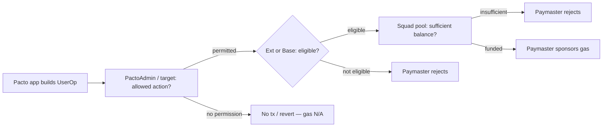
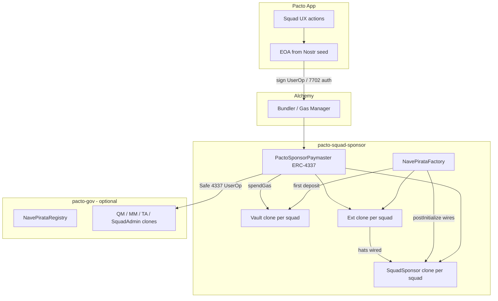

# Pacto Squad Sponsor — Technical Specification

**Status:** Draft (implementation-ready)  
**Repo:** [covenant-gov/pacto-squad-sponsor](https://github.com/covenant-gov/pacto-squad-sponsor)  
**Companion repo:** [covenant-gov/pacto-gov](https://github.com/covenant-gov/pacto-gov) (Nave Pirata governance)  
**Target chains (v1):** Ethereum Mainnet (`1`), Sepolia (`11155111`), Arbitrum One (`42161`)  
**Testing:** integration/e2e forks **mainnet**; Sepolia is **frontend live testing** against deployed contracts (D19)
**Solidity:** `0.8.30` (match pacto-gov)  
**License:** MIT  

---

## 0. Purpose of this document

This spec is written for an **implementing agent** working in **pacto-squad-sponsor** with no prior chat context. It defines:

- Product and security goals for **collective, squad-scoped gas sponsorship**
- On-chain architecture (single vault, multi-sponsor pro-rata accounting)
- Off-chain relayer integration (Alchemy v1; pluggable later)
- How sponsorship relates to **pacto-gov** via **`SquadSponsorExt.postInitialize`**
- **Executable milestones** through testnet and mainnet

**Out of scope for pacto-squad-sponsor v1:** Governance logic in pacto-gov ( **`PactoAdmin`**, factory wiring — tracked in [`PACTO_GOV_FOLLOWUPS.md`](./PACTO_GOV_FOLLOWUPS.md)). **Crew hat mint sponsorship** (captain-controlled; not v1). **On-chain balance alerts** (app-side only).

---

## 1. Product summary

### 1.1 Collective paradigm

Pacto squads are **groups that trust each other** and coordinate via roles (captain, crew, treasury, mutiny, app admin). On-chain governance uses **Hats Protocol** — wearers are addresses (EOAs or contracts).

**Goal:** One or more members fund a **shared gas pool** per squad. Members use the **Pacto app** without holding ETH or understanding gas. Any **permitted in-squad action** — including **deploying squad infrastructure** (PactoGov, Gnosis Safe, etc.) — is submitted via a **relayer + paymaster** when the squad pool can cover it.

This is intentionally **not** per-user gas abstraction. It is **squad-collective** sponsorship.

### 1.2 Independence from pacto-gov

| Layer | Repo | Role |
|--------|------|------|
| Rules & modules | **pacto-gov** | `Quartermaster`, `MutinyModule`, `TreasuryAuthority`, `SquadAdmin`, **`PactoAdmin`**, `NavePirataFactory`, `NavePirataRegistry` |
| Gas pools, eligibility modules, **ERC-4337 paymaster** | **pacto-squad-sponsor** | `SquadSponsorVault`, **`PactoSponsorPaymaster`** (ERC-4337), **`SquadSponsorExt`** (address primitive), **`SquadSponsor`** (hats base) |
| Transport (bundler / relay) | **Alchemy** (v1) | `eth_sendUserOperation`, Gas Manager → paymaster |
| UX | **Pacto app** | Keys (Nostr → EVM), UserOps (**ERC-4337**) + **EIP-7702** delegation, squad inbox |

**Modular pattern (mirrors `SquadAdmin` / `SquadAdminExt` in pacto-gov):**

| Contract | When deployed | Eligibility | 
|----------|---------------|-------------|
| **`SquadSponsorExt`** | **Always first** (with vault + paymaster), even if pacto-gov never deploys | **Address-based** — members who shared EVM with squad (app-synced; no Hats) |
| **`SquadSponsor`** (base) | When **pacto-gov** deploys **or** squad wires a **custom / arbitrary Hats tree** | **Hat-based** — wearers of configured squad hats (e.g. crew + captain for PactoGov) |

**`SquadSponsorExt` is deployed before pacto-gov.** It is the primitive expansion for address access control (no Hats, no plugin infra). **`SquadSponsor` base** is the Hats path — deployed with gov or a custom tree.

**Wiring:** When hats become available, **`SquadSponsorExt.postInitialize`** connects the pre-deployed Ext to **`SquadSponsor`** base (same backwards-compatible pattern as `SquadAdminExt.postInitialize`). Hat eligibility **overrides** address entries for that squad — including any prior custom hat setup.

**Callers of `postInitialize`:** `NavePirataFactory`, contract **owner**, or **Hats tree owner** — match `SquadAdminExt` auth in pacto-gov (see [`PACTO_GOV_FOLLOWUPS.md`](./PACTO_GOV_FOLLOWUPS.md)).

**No duplicate registries:** Address lists for sponsor gas live **only** in `SquadSponsorExt`. pacto-gov must not mirror them (QM crew state ≠ sponsor eligibility). When hats are wired, read Hats via base — do not maintain parallel address lists in gov.

**Undecided (note):** `SquadAdmin` contracts may move to a shared repo; sponsor modules should remain composable the same way.

**v1 eligibility modes (full feature set):** (1) address via Ext, (2) PactoGov hat tree via base + `postInitialize`, (3) custom / arbitrary Hats tree via base + `postInitialize` — not an admin toggle; determined by what has been deployed and wired.

### 1.3 What is sponsored (v1)

| Category | Gas sponsored? | Notes |
|----------|----------------|--------|
| Any squad action in **Pacto app UX** | **Yes** | Eligible member (§4.3) + pool balance |
| **Infrastructure deploy** (PactoGov, Safe, etc.) | **Yes** | `PactoAdmin` permission; sponsor pays gas |
| Permissionless gov `execute*` via app | **Yes** | Target enforces rules |
| **Crew hat mint** | **No (v1)** | Captain-controlled; deferred |
| Raw ETH / arbitrary calls | **No** | App never relays |

**Rule of thumb:** Eligible member + funded pool → gas covered. Action permission stays in **`PactoAdmin`** / target contracts (§1.4).

### 1.4 Permissions vs gas (critical separation)

**Two independent concerns:**

| Concern | Owner | Question |
|---------|--------|----------|
| **Permission** | **`PactoAdmin`** (pacto-gov) + target contracts | May this member perform this action (deploy gov, deploy Safe, crew vote, etc.)? |
| **Gas** | **pacto-squad-sponsor** | Will the squad pool pay for this UserOp’s gas? |

**Invariants:**

1. **Permission first, gas second.** If a member **lacks permission**, the transaction reverts or is never built — **gas sponsorship is irrelevant**.
2. **Permission granted → gas assumed covered** for **eligible** members when the pool has sufficient balance.
3. **The sponsor never grants action permission.** It only pays gas.
4. **Eligibility follows deployment wiring** — Ext (addresses) until `postInitialize` connects hat base; then hats override.



### 1.5 Account abstraction strategy

| Signer account | Detection | Transport |
|----------------|-----------|-----------|
| **EOA** (seed-derived) | `code.length == 0` or `0xef0100 \|\| impl` delegation stub | **EIP-7702** (one-time set-code) + **ERC-4337** UserOp + paymaster |
| **Gnosis Safe** (pause-captain, treasury) | Safe address with **4337 module enabled** | **ERC-4337** UserOp with **`userOp.sender` = Safe** + paymaster (§5.2) |
| **Contract wallet** (other smart accounts) | `code.length > 0` (not delegation-only) | **ERC-4337** UserOp; resolve signer per account implementation |

**v1 supports both EOAs and contract wallets.** Paymaster resolves the **beneficiary member** from `userOp.sender` (see §4.2): EOA directly; smart account → owner/signer per account implementation; 7702-delegated EOA treated as EOA with delegation stub.

Use one audited ERC-4337-compatible implementation per chain for 7702 delegation target.

References:

- [EIP-7702](https://eips.ethereum.org/EIPS/eip-7702) — Set code for EOAs (Pectra)
- [EIP-4337](https://eips.ethereum.org/EIPS/eip-4337) — Account abstraction
- [Alchemy Account Abstraction](https://www.alchemy.com/account-abstraction) / [Bundler docs](https://docs.alchemy.com/reference/bundler-api-quickstart)

---

## 2. Locked design decisions

| # | Decision |
|---|----------|
| D1 | **Per-squad vault clone** (minimal proxy) — each squad’s ETH isolated; reduces chain-wide honeypot vs one vault holding all squads |
| D2 | **ETH only** — no ERC-20 gas payment in v1 |
| D3 | **Multi-sponsor pro-rata** accounting per squad clone (deposit shares; withdraw proportional to remaining pool) |
| D4 | Depositors may **withdraw** unspent share; gas spend reduces everyone’s withdrawable amount proportionally — **owner cannot withdraw others’ deposits** |
| D5 | **Permissions ≠ gas** — action permission (`PactoAdmin`, target contracts) is separate from gas payment (this repo) |
| D6 | **Unmapped funds:** explicit `deposit` only; orphan ETH recoverable via `saviourWithdraw` on implementation / factory policy |
| D7 | **Not upgradeable** — new policy = new paymaster + new implementation if ever needed |
| D8 | **Deployment-driven eligibility** — Ext (address) until hat base wired via `postInitialize`; no admin mode toggle |
| D9 | Relayer v1: **Alchemy** bundler + Gas Manager → **ERC-4337** paymaster |
| D10 | **Per-squad clones:** `SquadSponsorExt` (+ vault) at squad bootstrap; **`SquadSponsor`** hat clone at wiring (mirrors `SquadAdminExt` / `SquadAdmin`) |
| D11 | **Hat wiring overrides** addresses (and prior custom hat config) — one-way `postInitialize` |
| D12 | **v1 eligibility paths:** address (Ext), PactoGov hats, custom Hats tree (same `postInitialize` pattern as **`PactoAdmin`**) |
| D13 | **EOA + contract wallets** via 7702 + 4337; **Gnosis Safe** as **ERC-4337 smart account** (Safe 4337 plugin — §5.2) |
| D18 | **Safe transport (locked):** Path **A** — Safe is `userOp.sender` via official / compatible **ERC-4337 Safe module**; not Safe SDK relay (B) or module-only EOA workaround (C) |
| D19 | **Integration / e2e fork mainnet** — Sepolia is deploy + frontend live testing only (§11) |
| D14 | **Three chains v1:** Mainnet (`1`), Sepolia (`11155111`), Arbitrum One (`42161`) |
| D15 | **Low-balance UX alerts** — app only |
| D16 | **`addressOwner` = first depositor** (“early bird”); role is eligibility admin only — **not** pool custody |
| D17 | **`addressOwner` transferable** — current owner may `transferAddressOwner(newOwner)` (§4.3.4) |

---

## 3. System architecture



**Execution invariant:** For hat-gated functions, **`msg.sender` must be the member EOA** (or valid contract wearer). The paymaster **never** calls `crewVote` as itself to “proxy” a vote.

**Policy invariant:** If `SquadSponsorExt.isHatsWired(squadId)` → `SquadSponsor.isEligible`; else → `SquadSponsorExt.isEligible`. Paymaster is **ERC-4337**; transport via bundler (§6.1). See [`PACTO_GOV_FOLLOWUPS.md`](./PACTO_GOV_FOLLOWUPS.md) for factory wiring.

---

## 4. On-chain contracts

### 4.0 `SquadSponsorFactory` + per-squad clones

**Problem:** A single chain-wide vault holding all squads’ ETH is a larger honeypot. **v1 uses minimal-proxy clones per squad** (same pattern as gov module clones).

**`SquadSponsorFactory`** (chain singleton):

- `createSquad(bytes32 squadId)` → deploys **`SquadSponsorVault`** clone + **`SquadSponsorExt`** clone, wired together.
- Called on **first deposit** for a `squadId` (or explicit app bootstrap tx).
- **`SquadSponsor`** hat clone created later when hats wire (gov or custom tree) via `postInitialize` path.
- Registry: `squadId` → `{ vault, ext, base?, topHatId? }`.

Paymaster is still a **chain singleton**; `paymasterAndData` includes the squad’s **vault clone address** (and `squadId` for sanity).

### 4.1 `SquadSponsorVault` (implementation + per-squad clone)

Each clone holds **one squad’s ETH only**. No cross-squad balance mapping inside a clone.

**Responsibilities (per clone):**

1. Hold ETH for **this squad** only (`bytes32 squadId` immutable in `initialize`).
2. Track **sponsor shares** (pro-rata).
3. Expose `spendGas` **only** to the wired paymaster.
4. `linkTopHat` — **only** from this squad’s **`SquadSponsorExt` clone** `postInitialize`.
5. Orphan receive handling / `saviourWithdraw` per implementation policy.

**First deposit / early bird:**

```solidity
function deposit() external payable;  // clone already bound to squadId
```

- On **`Factory.createSquad`**, **`msg.sender` (first depositor) becomes `addressOwner`** on the paired Ext clone (D16).
- Subsequent depositors only receive `sponsorShares`; they do **not** become owner automatically.

**Accounting (pro-rata)** — same formulas as before, scoped to single clone (no `squadId` key on mappings inside clone):

```
On deposit(amount):
  mint shares pro-rata → credit sponsorShares[msg.sender]

On withdraw():
  burn shares pro-rata → transfer ETH to msg.sender

On spendGas(amount):  // onlyPaymaster
  balance -= amount
```

### 4.2 `PactoSponsorPaymaster` (ERC-4337 verifying paymaster)

**Non-upgradeable.** Immutable constructor args:

- `IEntryPoint entryPoint`
- `SquadSponsorFactory factory` (resolve squad clones)
- `address hats` (Hats Protocol)
- Optional: `address walletImplementation` (7702 delegate allowlist)

Per-UserOp **`paymasterAndData`** includes: `vaultClone`, `extClone`, optional `baseClone`, `squadId` (checksum).

**`validatePaymasterUserOp` (high level):**

1. Decode squad clone addresses from `paymasterAndData`.
2. Check `vaultClone.balance >= maxCost` (headroom e.g. 115%).
3. Resolve **member** for eligibility:
   - **EOA / 7702 EOA:** `userOp.sender` (or delegated EOA)
   - **Safe (path A):** `userOp.sender` is the Safe; validate UserOp signatures against Safe owners/threshold via 4337 module; map to **signing owner** for eligibility (must be hat wearer / permitted address)
   - **Other smart accounts:** owner/signer per account `validateUserOp`
4. **Eligibility:** if `extClone.isHatsWired()` → `baseClone.isEligible(member)`; else → `extClone.isEligible(member)`.
5. Sanity checks — reject drain vectors; allow deploy txs; allow Safe **`execTransaction`** calldata when sender is Safe 4337 account (§5.2).
6. Gas limits per call class (deploy / Safe exec / default).
7. `postOp` → `vaultClone.spendGas(actualGasCost)`.

### 4.3 `SquadSponsorExt` + `SquadSponsor` clones (mirrors `SquadAdminExt` + `SquadAdmin`)

**Per-squad minimal-proxy clones** created by **`SquadSponsorFactory`**. Ext + vault clone at first deposit; **`SquadSponsor`** hat clone at hat wiring.

**Custom Hats tree (no full PactoGov):** same **`postInitialize`** pattern as **`PactoAdmin`** / `SquadAdminExt` in pacto-gov — factory or owner or Hats tree owner wires hat base to pre-deployed Ext clone.

#### 4.3.1 `SquadSponsorExt` clone — address primitive

One clone per squad. Immutable `squadId`, pointer to paired vault clone.

```solidity
contract SquadSponsorExt is ISquadSponsorEligibility {
  bytes32 public immutable squadId;
  SquadSponsorVault public immutable vault;
  address public addressOwner;
  bool public hatsWired;
  address public squadSponsorBase;  // hat clone once wired

  mapping(address => bool) public permittedAddress;

  function setPermittedAddress(address member, bool permitted) external onlyAddressOwner { ... }

  function postInitialize(uint256 topHatId, address _squadSponsorBase)
    external onlyFactoryOrOwnerOrHatsOwner
  {
    require(!hatsWired);
    hatsWired = true;
    squadSponsorBase = _squadSponsorBase;
    vault.linkTopHat(topHatId);
    emit HatsSponsorshipWired(squadId, topHatId, _squadSponsorBase);
  }

  function isEligible(address member) external view returns (bool) {
    return permittedAddress[member];
  }
}
```

**Address updates:** App squad inbox → **`addressOwner`** calls **`setPermittedAddress`**. Not duplicated in pacto-gov.

#### 4.3.2 `SquadSponsor` clone — hats (PactoGov or custom tree)

```solidity
contract SquadSponsor is ISquadSponsorEligibility {
  bytes32 public immutable squadId;
  IHats public immutable hats;
  INavePirataRegistry public immutable registry;  // optional for custom-tree-only
  uint256 public topHatId;
  uint256[] public customEligibleHats;

  function isEligible(address member) external view returns (bool) {
    // PactoGov: crew + captain from registry.deployment(topHatId)
    // Custom tree: any hat in customEligibleHats[]
    ...
  }
}
```

After **`postInitialize`**, paymaster uses **`SquadSponsor.isEligible`** — overrides Ext address list.

#### 4.3.3 `addressOwner` role (early bird)

**Who:** **`msg.sender` of first deposit** when `Factory.createSquad` runs (D16).

**What owner CAN do:**

| Action | Purpose |
|--------|---------|
| `setPermittedAddress(member, true/false)` | Sync squad inbox EVM shares → sponsor eligibility (pre-hat wiring) |
| `postInitialize(...)` | **Fallback** if `NavePirataFactory` fails to wire hats — same auth as factory path |
| `transferAddressOwner(newOwner)` | Hand off inbox/roster duty (D17) |

**What owner CANNOT do:**

| Forbidden | Why |
|-----------|-----|
| Withdraw others’ deposits | **`sponsorShares`** mapping — only own share withdrawable |
| Spend pool gas directly | Only paymaster deducts via validated UserOps |
| Change pro-rata accounting | Vault logic is fixed |
| Override hat eligibility after `postInitialize` | Hat clone takes over; address list ignored for gas |

**So yes:** depositors are protected by **`sponsorShares`**; **`addressOwner`** is purely **eligibility admin** for the address primitive + **`postInitialize` backup** — not a pool custodian.

#### 4.3.4 `transferAddressOwner` (Q5 explained)

**Question was:** Can `addressOwner` change over time?

**v1 default (D17):** **Yes** — `transferAddressOwner(newOwner)` callable only by current owner.

**Why it matters:**

- First depositor (“early bird”) may not remain the person managing squad inbox long-term.
- After gov deploy, captain might need to approve EVM shares on-chain — transfer owner to captain EOA or ops Safe **without moving pool funds**.
- Transfer affects **who can call `setPermittedAddress`** only; it does **not** affect **`sponsorShares`** or hat eligibility after wiring.

**If owner is lost:** pre-hat squads cannot update address list until factory/owner/Hats-owner runs `postInitialize` or ops intervenes — document recovery in app (same class of problem as lost admin keys elsewhere).

#### 4.3.5 Summary

| Artifact | Scope | Eligibility |
|----------|-------|-------------|
| `SquadSponsorFactory` | Chain singleton | Creates clones |
| `SquadSponsorVault` clone | Per squad | Holds **this squad’s ETH only** |
| `SquadSponsorExt` clone | Per squad | Address list |
| `SquadSponsor` clone | Per squad (when wired) | Hats |
| `PactoSponsorPaymaster` | Chain singleton | ERC-4337 |

### 4.5 Optional: `SquadAddressResolver` library (pure / internal)

When registry is configured and `topHatId` is linked, pure helpers for **optional** defense-in-depth:

- `squadTargets(Deployment d, UpgradeRecord[] upgrades) → address[]`
- `isSquadTarget(address target, Deployment d, UpgradeRecord[] upgrades)`

**Not** a selector allowlist — the app defines which calls are built. This library only answers “does this target belong to this squad’s deployment?”

---

## 5. Optional pacto-gov address resolution

Use this section when registry is wired. It supports optional paymaster target checks — **not** sponsorship eligibility.

### 5.1 Registry (optional)

`INavePirataRegistry` (`pacto-gov`):

- `deployment(uint256 topHatId) → Deployment`
- `upgradeAt(topHatId, i) → UpgradeRecord` (`newClone` replaces old role addresses)

When linked, resolve latest clone addresses on validation so upgraded role hats still match squad contracts. No manual pool update on upgrade.

### 5.2 Typical app-UX targets (reference for app + relay, not on-chain gate)

These are the governance surfaces the Pacto app exposes today. Sponsorship follows the app, not a duplicated on-chain selector table:

| Contract | Example UX actions |
|----------|-------------------|
| `TreasuryAuthority` | `propose`, `crewVote`, `captainVote`, `execute` |
| `MutinyModule` | `startMutinyTo*`, `castVote`, `executeMutiny`, `captainResign` |
| `Quartermaster` | crew add/remove |
| `SquadAdmin` | role create/delete, executor enable/disable |
| `NavePirataFactory` | `deployNavePirata` (when **`PactoAdmin`** permits) |
| Safe factory / setup | Safe deploy flows (when **`PactoAdmin`** permits) |

**Exclude from app UX (therefore never sponsored):** `AssetRescuer` sweeps, raw transfers, arbitrary unlisted calls.

**Safe (v1 — locked: Path A):** Gnosis Safe is fundamental to governance (pause-captain, treasury). Squads enable Safe’s **ERC-4337 compatibility** (Safe 4337 module / supported Safe version per chain).

**Flow:**

1. Safe has 4337 module installed; Safe address is a valid **`userOp.sender`**.
2. App builds **ERC-4337 UserOp** whose `sender` is the **Safe** and `callData` is **`execTransaction(...)`** (or module batch).
3. Safe owners sign the UserOp per 4337 rules (threshold / owners).
4. Bundler → **`PactoSponsorPaymaster`** validates:
   - At least one validated signer is **eligible** (hat wearer or Ext permitted address)
   - Inner call targets are app-allowed (gov modules, treasury, etc.)
5. `postOp` → squad vault clone pays gas.

**Also sponsor:** module paths (QM/MM/TA) where **`msg.sender`** is member EOA when app uses direct module calls instead of Safe exec.

**Out of scope v1:** Path B (Safe SDK + external relay without 4337 sender), Path C (EOA-only workaround).

Pin Safe + 4337 module addresses per chain in `deployments/<chainId>/sponsor.json`. Reference: [Safe supported networks](https://docs.safe.global/advanced/smart-account-supported-networks).

### 5.3 Hat checks (optional)

Target contracts enforce `HatGated` via `IHats.isWearerOfHat(msg.sender, hatId)`. Paymaster may optionally pre-check wearers when registry is linked; **authorization remains on the target contract**.

---

## 6. Off-chain / app integration

### 6.1 Alchemy + ERC-4337 (v1)

1. **`PactoSponsorPaymaster`** (ERC-4337 verifying paymaster) staked on EntryPoint.
2. **Gas Manager** policy → paymaster address.
3. **Bundler** `eth_sendUserOperation` — this is the “relayer” (Alchemy submits UserOps; members still sign).
4. App flow:
   - Resolve `squadId`, chainId, eligibility path (Ext vs Base)
   - **Low balance:** app-side alert only — no on-chain threshold
   - EOA: 7702 delegation if needed, then ERC-4337 UserOp + paymaster
   - Contract wallet / **Safe (4337 module):** ERC-4337 UserOp with `sender` = account / Safe (§5.2)
   - Sign → bundler → paymaster validates → vault pays gas

Docs:

- [Alchemy AA Overview](https://docs.alchemy.com/docs/account-abstraction-overview)
- [Gas Manager policies](https://docs.alchemy.com/docs/gas-manager-services)

### 6.2 Pacto app data model

Per squad per chain:

```ts
type SquadSponsorState = {
  squadId: `0x${string}`;
  hatsWired: boolean;           // SquadSponsorExt.postInitialize done
  topHatId?: bigint;
  eligibilitySource: 'ADDRESS' | 'HATS';  // derived from deployment
  permittedMembers?: Address[]; // Ext only, when !hatsWired
  vaultAddress: Address;
  paymasterAddress: Address;    // ERC-4337
  squadSponsorExtAddress: Address;
  squadSponsorBaseAddress?: Address;
  balanceWei: bigint;
  sponsors: { address: Address; shares: bigint; withdrawableWei: bigint }[];
};
```

### 6.4 Squad inbox — EVM share (app; out of scope for this repo)

1. EVM share moves to **squad inbox** (from DMs).
2. App calls **`SquadSponsorExt.setPermittedAddress`** via **`addressOwner`** for that squad.
3. **Crew hat mint prompts** — deferred (not v1); captain-controlled minting off sponsor path for now.

### 6.3 Error UX (fallback)

Prefer sponsorship “just works.” On failure:

- `INSUFFICIENT_SQUAD_GAS` — pool empty
- `NOT_ELIGIBLE` — not on Ext address list (pre-wiring) or not hat wearer (post-wiring)
- `POLICY_REJECTED` — call not accepted by relay / failed on-chain sanity check
- `DELEGATION_REQUIRED` — EOA needs 7702 setup (one-tap retry)

Optional: deep link for sponsor to `deposit(squadId)` with suggested amount.

---

## 7. Security considerations

| Risk | Mitigation |
|------|------------|
| Unauthorized pool spend | `isEligible` via Ext or Base on every ERC-4337 UserOp |
| Pre-gov address spam | `setPermittedAddress` gated by `addressOwner`; app gates inbox share |
| Unauthorized action (deploy, admin, etc.) | **`PactoAdmin`** + target contracts — sponsor does not enforce; tx reverts before gas matters |
| Paymaster drains vault on arbitrary calls | Spend permission + app relay policy; reject drain patterns; optional registry target check when linked |
| Reentrancy from spend | CEI; `spendGas` nonReentrant |
| Sponsor share inflation | `mulDiv` on deposit; no donation attack without ETH |
| Unmapped ETH lock | `saviourWithdraw` + explicit `unallocated` accounting |
| Malicious 7702 implementation | Allowlist single `walletImplementation`; app must not sign arbitrary delegation |
| Cross-squad drain | `squadId` in paymaster data must match linked `topHatId`; no spend without balance on that id |
| Upgrade clone swap | Read `upgradeAt` on every validation (cache in indexer off-chain, verify on-chain) |

**Audits:** Before mainnet, internal review + external audit recommended for paymaster + vault.

---

## 8. pacto-gov integration

See **[`PACTO_GOV_FOLLOWUPS.md`](./PACTO_GOV_FOLLOWUPS.md)** for required pacto-gov PRs.

Summary: **`SquadSponsorExt` pre-deployed** → squad uses address mode → factory gov deploy → **`postInitialize`** wires **`SquadSponsor`** base → hat eligibility overrides addresses.

---

## 9. Repository layout (target)

```
pacto-squad-sponsor/
├── docs/
│   ├── TECH_SPEC.md
│   └── PACTO_GOV_FOLLOWUPS.md
├── src/
│   ├── interfaces/
│   │   ├── ISquadSponsorVault.sol
│   │   └── IPactoSponsorPaymaster.sol
│   └── contracts/
│       ├── SquadSponsorFactory.sol
│       ├── SquadSponsorVault.sol
│       ├── SquadSponsor.sol
│       ├── SquadSponsorExt.sol
│       ├── PactoSponsorPaymaster.sol
│       └── libraries/
│           └── SquadAddressResolver.sol
├── script/
│   ├── Constants.sol         # public: EntryPoint, Hats, deployed addresses per chain
│   ├── Deploy.s.sol
│   └── WirePaymaster.s.sol
├── test/
│   ├── unit/
│   │   ├── SquadSponsorVault.t.sol
│   │   └── PactoGovPolicy.t.sol
│   └── integration/
│       └── SponsorWithGovFork.t.sol   # fork **mainnet** + pacto-gov addresses
├── remappings.txt             # pacto-gov interfaces as submodule @pacto-gov/...
└── deployments/<chainId>/sponsor.json
```

**Dependencies:**

- OpenZeppelin Contracts
- `account-abstraction` (eth-infinitism)
- **pacto-gov** (submodule, optional): `INavePirataRegistry` for fork tests and `SquadAddressResolver` — pin commit tag; **not** a runtime dependency for gov-free deployment

Remove boilerplate `Greeter` when implementing.

---

## 10. Executable implementation plan

### Phase 0 — Repo hygiene

- ✅ Remove `Greeter` sample; align `foundry.toml` with pacto-gov (`solc 0.8.30`, `lintspec`, CI).
- ✅ Add `pacto-gov` dependency via `pnpm` + `remappings.txt` (read-only interfaces; no `lib/` submodule).
- ✅ Add `script/Constants.sol` for public chain + deployment addresses; `.env.example` for **private keys/RPC only**

### Phase 1 — Factory + vault + Ext clones

- ✅ `SquadSponsorFactory`: `createSquad`, first-depositor → `addressOwner`, vault + Ext clones.
- ✅ `SquadSponsorVault` implementation: pro-rata deposit/withdraw, `spendGas`, `linkTopHat`.
- ✅ `SquadSponsorExt` clone: `setPermittedAddress`, `transferAddressOwner`, `postInitialize`.

### Phase 2 — SquadSponsor hat clone + ERC-4337 paymaster

- ✅ `SquadSponsor` hat clone: PactoGov (crew + captain) + custom eligible hat list.
- ✅ `PactoSponsorPaymaster`: eligibility routing (Ext vs Base); **`paymasterAndData`** decode (§10.1); EOA member binding (Safe 4337 signer path deferred).
- ✅ Unit tests: vault isolation; address → `postInitialize` → hats; paymaster validation (28 tests passing).
- [ ] **Integration / e2e:** fork **mainnet** via `IntegrationBase._forkMainnet()` (D19).

### Phase 3 — Mainnet + Arbitrum

- [ ] Deploy Factory + Paymaster on `1` and `42161`; commit `deployments/<chainId>/sponsor.json`
- [ ] Pin EntryPoint + Hats + Safe 4337 module addresses per chain (§10.1)
- [ ] Audit checklist before mainnet

### Phase 4 — pacto-gov factory (parallel / after mainnet deploy)

- [ ] Items in [`PACTO_GOV_FOLLOWUPS.md`](./PACTO_GOV_FOLLOWUPS.md) — not blocking Phases 0–2 in this repo

---

### 10.1 Implementation appendix (for executing agent)

**Confidence:** Phases **0–2** core contracts and unit tests are complete in this repo. Phase 4 needs pacto-gov PR. Deploy scripts exist but are out of scope until you choose to broadcast.

#### Dependencies (Phase 0)

```bash
forge install OpenZeppelin/openzeppelin-contracts@v5.1.0
forge install eth-infinitism/account-abstraction@v0.7.0
forge install foundry-rs/forge-std
git submodule add https://github.com/covenant-gov/pacto-gov lib/pacto-gov  # interfaces + fork tests
```

Remappings to add: `@openzeppelin/`, `@account-abstraction/`, `@pacto-gov/`.

#### Clone pattern

- Use OpenZeppelin **`Clones` (EIP-1167)** minimal proxies.
- **`SquadSponsorFactory`** holds implementation addresses; `createSquad(bytes32 squadId)` clones **Vault + Ext**, initializes with `squadId`, sets **`addressOwner = msg.sender`** (first depositor path) or separate `createSquad` then `deposit` — prefer **create + deposit in one tx** from app/factory helper.
- **`SquadSponsor`** hat implementation cloned once per squad inside **`postInitialize`**.

#### `paymasterAndData` layout (v1)

```
byte version = 1;
bytes32 squadId;
address vaultClone;
address extClone;
address baseClone;  // zero if !hatsWired
```

Paymaster validates clone addresses against **`SquadSponsorFactory`** registry for `squadId` (anti-spoof).

#### Chain constants (verify before mainnet deploy)

Canonical source: **`script/Constants.sol`** (`Constants.getConfig(chainId)`). Do not duplicate in `.env`.

| Chain | chainId | EntryPoint v0.7 | Hats v1 |
|-------|---------|-----------------|---------|
| Sepolia | 11155111 | in Constants | in Constants |
| Mainnet | 1 | in Constants | in Constants |
| Arbitrum One | 42161 | in Constants | in Constants |

**Safe 4337 (Path A):** Pin **Safe4337Module** / compatible module address per chain from [Safe docs](https://docs.safe.global/) at deploy time; store in `deployments/<chainId>/sponsor.json`. Paymaster validates UserOp via module’s expected `validateUserOp` / owner signature layout — mirror Safe’s reference integration tests.

#### Configuration split

| Private (`.env` only) | Public (`script/Constants.sol`) |
|------------------------|----------------------------------|
| `MAINNET_RPC`, `SEPOLIA_RPC`, `ARBITRUM_RPC` | `entryPoint`, `hats` per chain |
| `ETHERSCAN_API_KEY`, `ALCHEMY_API_KEY` | `navePirataRegistry`, `safe4337Module` |
| `*_DEPLOYER_NAME` (keystore labels) | `squadSponsorFactory`, `paymaster` after deploy |
| | `mainnetForkBlock` for integration tests |

After deploy, update **`Constants.sol`** (and optionally `deployments/<chainId>/sponsor.json` for app consumption).

#### `.env.example` (Phase 0)

Private keys and RPC URLs only — see repo `.env.example`.

#### External resources that de-risk (nice-to-have, not blocking Phase 0–1)

| Resource | Why |
|----------|-----|
| **`SquadAdminExt.sol`** from pacto-gov (submodule) | Copy `postInitialize` auth modifiers exactly |
| **`INavePirataRegistry.sol`** | `SquadSponsor.isEligible` PactoGov path |
| Published pacto-gov **mainnet** `deployments/` (or pinned mainnet addresses) | Integration fork tests (D19) |

#### Explicitly deferred (do not implement in first PR)

- Crew hat mint sponsorship
- pacto-gov factory `postInitialize` call (Phase 4)
- On-chain low-balance alerts

---

## 11. Testing requirements

| Test type | Environment | Requirement |
|-----------|-------------|-------------|
| **Unit** | Local (no fork) | 100% path coverage on vault accounting; resolver + drain-vector rejection |
| **Integration / e2e** | **Mainnet fork** (`MAINNET_RPC`, pinned block in `IntegrationBase`) | Real Hats, Safe, registry/pacto-gov addresses; sponsored UserOp or `vm.prank` EntryPoint |
| **Fuzz** | Local | deposit/withdraw/spend sequences preserve `sum(withdrawable) <= balance` |
| **Gas** | Local | Cap tables enforced — oversized UserOp rejected |
| **Frontend live** | **Sepolia deploy** (Phase 3) | App + Alchemy bundler against deployed contracts — **not** Foundry fork tests |

CI integration job uses `MAINNET_RPC` secret for fork tests. `SEPOLIA_RPC` is for deploy scripts and manual frontend QA only.

---

## 12. Open decisions (minimal — default if unanswered)

| ID | Question | **Default for v1** |
|----|----------|---------------------|
| Q1 | `postInitialize` auth | Factory, **`addressOwner`**, or Hats owner — match `SquadAdminExt` |
| Q2 | `addressOwner` bootstrap | **First depositor** on `createSquad` (D16) |
| Q3 | Custom Hats without PactoGov | **`postInitialize`** — same norm as **`PactoAdmin`** (locked) |
| Q4 | Per-squad vault clone | **Yes** — honeypot isolation (D1) |
| Q5 | `addressOwner` transfer | **Transferable** by current owner (D17) |
| Q6 | Safe sponsorship | **Path A locked** — Safe as ERC-4337 smart account (D18) |
| Q7 | Optional address revoke | Optional — not critical v1 |
| Q8 | Chains | Mainnet, Sepolia, Arbitrum One |

---

## 13. Reference links

| Topic | URL |
|-------|-----|
| EIP-7702 | https://eips.ethereum.org/EIPS/eip-7702 |
| EIP-4337 | https://eips.ethereum.org/EIPS/eip-4337 |
| ERC-4337 EntryPoint v0.7 | https://github.com/eth-infinitism/account-abstraction |
| Hats supported chains | https://docs.hatsprotocol.xyz/using-hats/hats-protocol-supported-chains |
| Safe deployments | https://docs.safe.global/advanced/smart-account-supported-networks |
| pacto-gov registry | `src/interfaces/factory/INavePirataRegistry.sol` |
| Alchemy AA | https://docs.alchemy.com/docs/account-abstraction-overview |
| Pectra / 7702 rollout | Check Ethereum Foundation Pectra notes per network before enabling on mainnet |

---

## 14. Agent handoff checklist

Before marking v1 complete:

1. `forge test` green in pacto-squad-sponsor
2. `lintspec` / `forge fmt` clean
3. README updated: collective model, deposit/withdraw, **permissions vs gas**
4. Explicit note: factory co-deploy is optional PR in pacto-gov — sponsor repo stands alone

---

*End of spec.*
